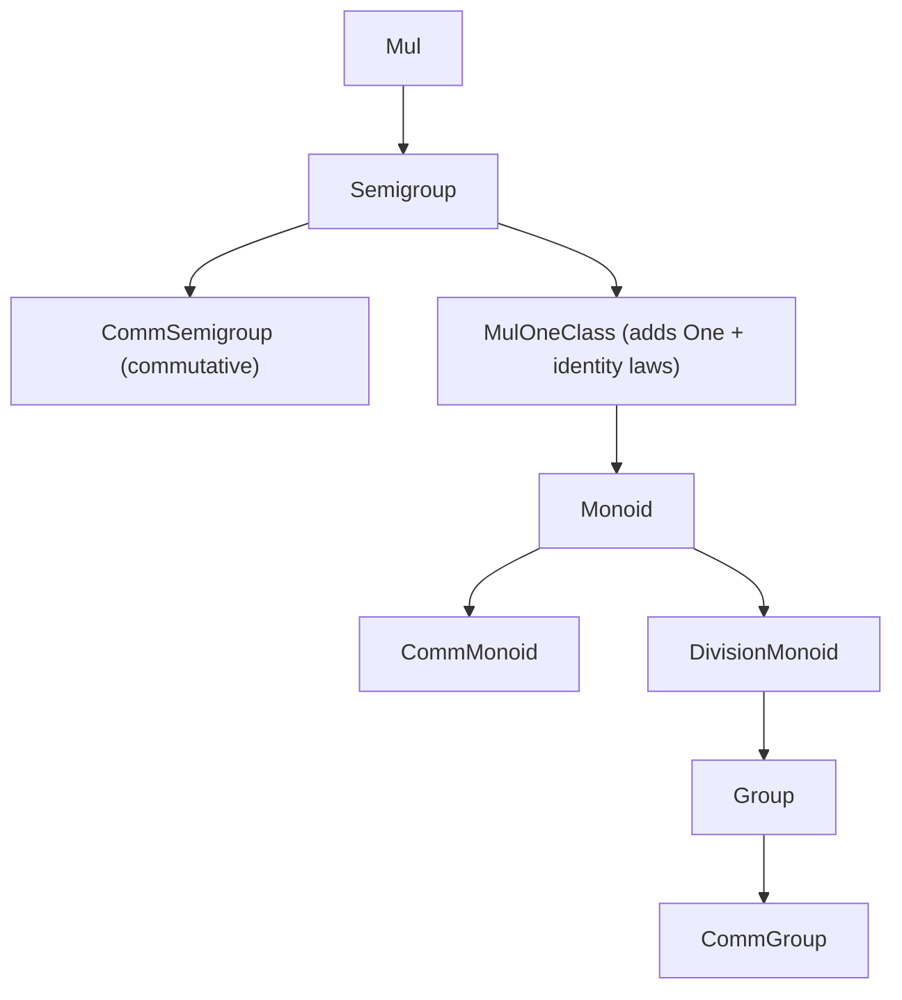
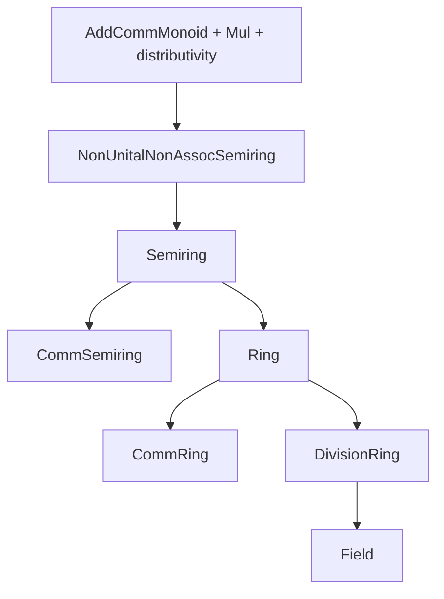
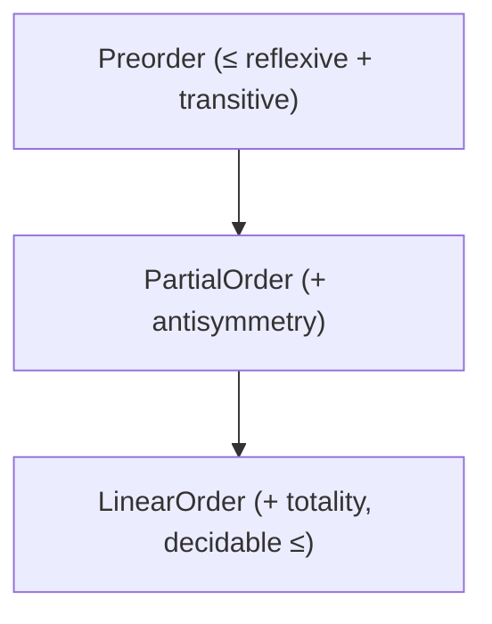
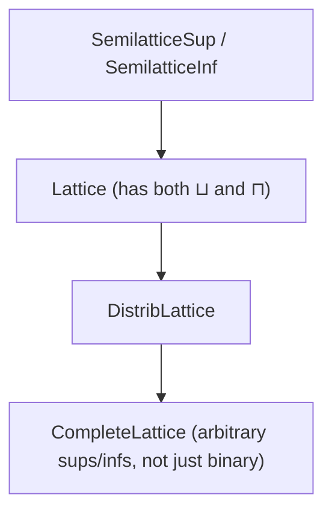

# The Lean 4 Typeclassopedia

A field guide to Lean 4's typeclasses, in the spirit of the Haskell Typeclassopedia.

Lean 4's typeclass landscape splits cleanly into two layers that are worth
keeping mentally separate:

- **Part 1 — Core / std.** The typeclasses baked into `Init` (Lean core) and
  `Std`/`Batteries`. These drive *notation elaboration* (`+`, `[]`, `∈`, `for`,
  `<|>`, ...), decidability, and the handful of functional-programming
  abstractions (`Functor`, `Monad`, ...) that Lean needs to make `do`-notation
  work. You get these for free in every Lean 4 project, no imports required
  beyond core.
- **Part 2 — Mathlib.** A much larger algebraic/order/category hierarchy
  (`Semigroup`, `Ring`, `Lattice`, `Category`, ...) built *on top of* some of
  the Part 1 classes (`Add`, `Mul`, `Zero`, `LE`, ...). This is a library
  design, not a language feature — you opt into it by importing Mathlib.

If your proof work stays in core-tactics-only territory (`omega`, `decide`,
`simp`, `cases`, no Mathlib), you'll live almost entirely in Part 1. Part 2 is
included for completeness and because the hierarchy is a well-known reference
point even when you're not importing it.

A note on mechanics before diving in: Lean typeclasses are just structures (or
inductives) marked `class`, resolved by the elaborator via a depth-first
search over registered `instance` declarations, guided by `outParam` and
`semiOutParam` annotations that tell the search which arguments to treat as
*outputs* rather than inputs. Keep that model in mind — a lot of "why did this
instance not fire" debugging comes down to outParam / metavariable ordering.

---

## Part 1 — Lean 4 Core & Std

### 1. Foundational classes

**`Inhabited`** — witnesses that a type is nonempty *and* hands you a
canonical element.

```lean
class Inhabited (α : Sort u) where
  default : α
```

Used by `Classical.arbitrary`-free code paths, `Array.get!`-style panicking
accessors (via `Inhabited.default` as the fallback), and anywhere the
elaborator needs *some* value of a type to make a partial function total in
the metaprogramming sense.

**`Nonempty`** — the `Prop`-valued cousin: witnesses existence without
handing you a specific element (so it doesn't leak data in proof-irrelevant
contexts).

```lean
class Nonempty (α : Sort u) : Prop where
  intro :: (val : α)
```

Because it's a `Prop`, two proofs of `Nonempty α` are definitionally equal —
you can't extract `val` computationally, only reason about it.

**`Subsingleton`** — at most one element, up to propositional equality.

```lean
class Subsingleton (α : Sort u) : Prop where
  allEq : ∀ (a b : α), a = b
```

Every `Prop` is a subsingleton (proof irrelevance); this class generalizes
that fact to arbitrary types (e.g. `Unit`, or any type with an injection into
a subsingleton).

Gotcha: `Inhabited`, `Nonempty`, `Subsingleton` are all *separate* claims —
`Nonempty` doesn't give you `Inhabited` (that requires `Classical.choice` or
`Decidable`-style constructive evidence), and `Inhabited` doesn't give you
`Subsingleton` (a type can have a canonical default and still have many
distinct elements).

### 2. Decidability & equality

**`Decidable`** — a `Prop` that comes with a computable verdict.

```lean
class inductive Decidable (p : Prop) where
  | isFalse (h : ¬p) : Decidable p
  | isTrue  (h : p)  : Decidable p
```

This is what powers `if h : p then ... else ...` and `decide`/`native_decide`.
`DecidableEq` is just sugar over it:

```lean
abbrev DecidableEq (α : Sort u) := (a b : α) → Decidable (a = b)
```

**`BEq`** — boolean equality, deliberately *not* required to be lawful.

```lean
class BEq (α : Type u) where
  beq : α → α → Bool
```

**`LawfulBEq`** — the law that ties `BEq` back to propositional `=`:

```lean
class LawfulBEq (α : Type u) [BEq α] : Prop where
  eq_of_beq : beq a b = true → a = b
  rfl       : beq a a = true
```

Why the split? Some useful `BEq` instances are intentionally non-lawful —
e.g. `NaN != NaN` for floats, or approximate/structural equality that ignores
metadata fields. Lean makes you *opt in* to lawfulness rather than assuming
it, which matters a lot for your BF16/FPU verification work: `BEq Float`-style
instances are exactly where a `LawfulBEq` assumption would be silently false.

**`Ord`** — a total-order-flavored comparator (three-way, not boolean).

```lean
class Ord (α : Type u) where
  compare : α → α → Ordering  -- Ordering := lt | eq | gt
```

There's no single canonical "`LawfulOrd`" in core the way there is for `BEq`;
laws about `compare` agreeing with `LE`/`LT` are a Mathlib/Std-level concern
layered on top when needed.

**`Hashable`**

```lean
class Hashable (α : Sort u) where
  hash : α → UInt64
```

Consumed by `Std.HashMap`/`Std.HashSet`. Convention (not enforced by the
type system): `a == b → hash a = hash b` when a `LawfulBEq` instance exists.

### 3. Display & debugging

```lean
class Repr (α : Type u) where
  reprPrec : α → Nat → Std.Format

class ToString (α : Type u) where
  toString : α → String
```

`Repr` aims for round-trippable, precedence-aware output (what you get from
`#eval` and `deriving Repr`); `ToString` is for human-facing display and
backs string interpolation `s!"..."`.

### 4. Coercions

```lean
class Coe     (α : Sort u) (β : Sort v)              where coe : α → β
class CoeSort (α : Sort u) (β : Sort v)              where coe : α → β  -- target a Sort, e.g. Type from a structure
class CoeFun  (α : Sort u) (β : outParam (α → Sort v)) where coe : (f : α) → β f
```

Note the `outParam` on `CoeFun`'s second argument — the *shape* of the
function type is computed from `α`, not searched for independently. There
are also `CoeHead`/`CoeTail`/`CoeHTCT` etc. used internally to chain
coercions; you rarely write instances of those directly.

### 5. Numeric literals & operator overloading

The core design principle: **every notation is heterogeneous by default**,
with a homogeneous instance layered on top for the common case.

```lean
class OfNat (α : Type u) (n : Nat) where
  ofNat : α

class Add (α : Type u) where
  add : α → α → α

class HAdd (α : Type u) (β : Type v) (γ : outParam (Type w)) where
  hAdd : α → β → γ

instance [Add α] : HAdd α α α := ⟨Add.add⟩
```

`a + b` elaborates to `HAdd.hAdd a b`, *not* `Add.add a b` — `Add` only
enters the picture via the default instance above. This is why you can add a
`Nat` and a `Fin n` in some libraries without an explicit cast: someone wrote
a bespoke `HAdd` instance rather than routing through `Add`. Same pattern for
`Sub`/`HSub`, `Mul`/`HMul`, `Div`/`HDiv`, `Mod`/`HMod`, `Pow`/`HPow`,
`Append`/`HAppend`, `AndThen`/`HAndThen`.

`Neg` is homogeneous-only (no `HNeg`):

```lean
class Neg (α : Type u) where
  neg : α → α
```

Bitwise operators get their own dedicated classes, mostly relevant to your
`UInt64`/bit-vector-flavored ALU work:

```lean
class AndOp      (α : Type u) where and : α → α → α         -- &&&
class OrOp       (α : Type u) where or  : α → α → α         -- |||
class Xor        (α : Type u) where xor : α → α → α         -- ^^^
class ShiftLeft  (α : Type u) where shiftLeft  : α → α → α  -- <<<
class ShiftRight (α : Type u) where shiftRight : α → α → α  -- >>>
class Complement (α : Type u) where complement : α → α      -- ~~~
```

`OfScientific` handles scientific-notation numeric literals (`1.5e10`)
analogously to `OfNat`.

### 6. Collection protocol

```lean
class GetElem (coll : Type u) (idx : Type v)
              (elem : outParam (Type w))
              (valid : outParam (coll → idx → Prop)) where
  getElem : (c : coll) → (i : idx) → valid c i → elem
```

This is the class behind `xs[i]` notation; the `valid` outParam is what forces
you to either discharge an in-bounds proof (`xs[i]'h`), use the panicking
`xs[i]!`, or the option-returning `xs[i]?` (the latter two are derived via
companion classes/defaults rather than being separate primitive notations).
This class has been reworked more than once across Lean versions — if you're
implementing a custom indexed collection, check the current core source
rather than assuming the exact shape above hasn't shifted.

```lean
class Membership (α : outParam (Type u)) (γ : Type v) where
  mem : α → γ → Prop
```

Backs `a ∈ s`. (Argument order here has also been a point of churn across
versions — worth double-checking against your toolchain.)

```lean
class EmptyCollection (α : Type u) where emptyCollection : α    -- ∅ / {}
class Insert (α : outParam (Type u)) (γ : Type v) where insert : α → γ → γ
class Singleton (α : outParam (Type u)) (γ : Type v) where singleton : α → γ
class Union (α : Type u) where union : α → α → α                -- ∪
class Inter (α : Type u) where inter : α → α → α                -- ∩
class SDiff (α : Type u) where sdiff : α → α → α                -- \
class Append (α : Type u) where append : α → α → α              -- default HAppend instance, ++
```

These are what let `List`, `Array`, `Std.HashSet`, `Finset` (Mathlib), etc.
all share `{}`, `∈`, `∪`, `++` notation without a shared base type.

### 7. Functional-programming core

```lean
class Functor (f : Type u → Type v) where
  map      : {α β : Type u} → (α → β) → f α → f β
  mapConst : {α β : Type u} → α → f β → f α := fun a => Functor.map (fun _ => a)

class Applicative (f : Type u → Type v) extends Functor f where
  pure : {α : Type u} → α → f α
  seq  : {α β : Type u} → f (α → β) → (Unit → f α) → f β
  seqLeft  : {α β : Type u} → f α → (Unit → f β) → f α := ...
  seqRight : {α β : Type u} → f α → (Unit → f β) → f β := ...

class Monad (m : Type u → Type v) extends Applicative m where
  bind : {α β : Type u} → m α → (α → m β) → m β
```

Note `extends`, not independent classes — every `Monad` *is* an
`Applicative` *is* a `Functor`, with `map`/`pure`/`seq` derivable from `bind`
via default implementations, so writing a `Monad` instance is usually just
supplying `pure` and `bind`.

**Lawful variants** parallel `BEq`/`LawfulBEq`:

```lean
class LawfulFunctor (f : Type u → Type v) [Functor f] : Prop where
  map_const : (Functor.mapConst : α → f β → f α) = Functor.map ∘ Function.const β
  id_map    : ∀ (x : f α), id <$> x = x
  comp_map  : ∀ (g : α → β) (h : β → γ) (x : f α), (h ∘ g) <$> x = h <$> (g <$> x)

class LawfulApplicative (f : Type u → Type v) [Applicative f] extends LawfulFunctor f : Prop where
  seqLeft_eq  : ...
  seqRight_eq : ...
  pure_seq    : ∀ (g : α → β) (x : f α), pure g <*> x = g <$> x
  map_pure    : ∀ (g : α → β) (x : α), g <$> (pure x : f α) = pure (g x)
  seq_pure    : ...
  seq_assoc   : ...

class LawfulMonad (m : Type u → Type v) [Monad m] extends LawfulApplicative m : Prop where
  bind_pure_comp : ∀ (g : α → β) (x : m α), x >>= (pure ∘ g) = g <$> x
  bind_map       : ...
  pure_bind      : ∀ (x : α) (g : α → m β), pure x >>= g = g x
  bind_assoc     : ∀ (x : m α) (g : α → m β) (h : β → m γ),
                     (x >>= g) >>= h = x >>= (fun a => g a >>= h)
```

The three monad laws (`pure_bind`, and the two halves folded into
`bind_assoc` / `bind_pure_comp`) are the ones you'd recognize from Haskell's
left identity / right identity / associativity trio.

```lean
class Alternative (f : Type u → Type v) extends Applicative f where
  failure : {α : Type u} → f α
  orElse  : {α : Type u} → f α → (Unit → f α) → f α
```

Backs `<|>` and `failure`; `Option` and `Array`/`List`-as-nondeterminism-monad
are the usual examples.

### 8. Iteration protocol

Lean has no Haskell-style `Foldable`/`Traversable` in core. Instead, `for x in
xs do ...` desugars via a dedicated pair of classes:

```lean
class ForIn (m : Type u → Type v) (ρ : Type w) (α : outParam (Type x)) where
  forIn : ρ → β → (α → β → m (ForInStep β)) → m β

class ForM (m : Type u → Type v) (ρ : Type w) (α : outParam (Type x)) where
  forM : ρ → (α → m PUnit) → m PUnit
```

`ForInStep β` (`.yield` / `.done`) is how a `for` loop body signals early
`break`. Writing a `ForIn` instance for a custom data structure is what makes
it directly loop-able without materializing a `List` first.

### 9. Monad transformer plumbing

Relevant if you touch `StateT`/`ReaderT`/`ExceptT` stacks (e.g. structuring a
Hypothesis-driven cocotb harness's internal state):

```lean
class MonadLift    (m : Type u → Type v) (n : Type u → Type w) where
  monadLift : {α : Type u} → m α → n α

class MonadFunctor (m : Type u → Type v) (n : Type u → Type w) where
  monadMap : {α : Type u} → ({β : Type u} → m β → m β) → n α → n α

class MonadState  (σ : outParam (Type u)) (m : Type u → Type v) where
  get : m σ
  set : σ → m PUnit
  modifyGet : {β : Type u} → (σ → β × σ) → m β

class MonadExceptOf (ε : Type u) (m : Type v → Type w) where
  throw : {α : Type v} → ε → m α
  tryCatch : {α : Type v} → m α → (ε → m α) → m α
```

`outParam` on the state/exception type is what lets `get`/`throw` resolve
without you annotating the type explicitly at every call site, even threaded
through several transformer layers via `MonadLift`.

---

## Part 2 — Mathlib's Algebraic Hierarchy

Mathlib does *not* invent a parallel notion of `+`/`*`/`≤` — it reuses the
core `Add`, `Mul`, `Neg`, `LE`, `LT` classes from Part 1 and layers
*properties* on top as further classes (mostly `Prop`-valued mixins combined
via `extends`), so the diamond problem is managed by a huge, carefully
engineered `extends` graph rather than duplicated operations.

### 1. Algebraic hierarchy (multiplicative side; additive side mirrors it)





Everything on the additive side has a `+`-flavored mirror generated
automatically via the `to_additive` attribute: `Semigroup → AddSemigroup`,
`Monoid → AddMonoid`, `Group → AddGroup`, etc. — so you almost never write
the additive versions by hand.

### 2. Ring / field hierarchy





`Ring` = `AddCommGroup` + `Monoid` (multiplicative, not necessarily
commutative) + distributivity laws. `Field` additionally requires
multiplicative inverses for nonzero elements and commutativity.

### 3. Order hierarchy





Orthogonal to that, the lattice family:





Ordered algebraic structures combine both trees, e.g. `OrderedSemiring`,
`LinearOrderedField` — a `LinearOrderedField` is simultaneously a `Field` and
a `LinearOrder` with compatibility axioms (`a ≤ b → a + c ≤ b + c`, etc.)
mixed in.

### 4. Category theory (`Mathlib.CategoryTheory`)

```lean
class CategoryTheory.Category (obj : Type u) extends Quiver.{v} obj where
  id       : (X : obj) → X ⟶ X
  comp     : {X Y Z : obj} → (X ⟶ Y) → (Y ⟶ Z) → (X ⟶ Z)
  id_comp  : ...
  comp_id  : ...
  assoc    : ...
```

`CategoryTheory.Functor` (structure-preserving map between categories,
*not* the Part 1 `Functor` — different namespace, easy to confuse when
searching docs) and `NatTrans` (natural transformations) sit on top, giving
you the actual Haskell-Typeclassopedia-flavored `Functor`/`Monad`
abstractions but generalized to arbitrary categories instead of fixed to
`Type u → Type v`.

### 5. Analysis (brief pointer only)

`TopologicalSpace → UniformSpace → MetricSpace → NormedAddCommGroup →
NormedSpace` is the rough chain used once you're doing real/complex analysis
in Mathlib; each layer adds structure (open sets → uniformity → distance →
norm → scalar-compatible norm) without touching the algebraic hierarchy
above it, which is why a `NormedField` can simultaneously be a `Field` and a
`MetricSpace` via two independent `extends` chains meeting at one type.

---

## Quick-reference: where to look when instance search fails

1. **Check `outParam`/`semiOutParam` placement** — an argument not marked
   `outParam` must be fully known *before* Lean starts the search; if it's a
   metavariable, resolution stalls or picks the wrong instance.
2. **`extends` vs. separate `class` + `[...]` argument** — `extends` bakes a
   parent instance in as a field (one search, one instance found gives you
   both); separate instance arguments trigger independent searches, which is
   how diamonds get resolved explicitly rather than silently.
3. **Default methods are instance-local, not global** — a `Monad` instance
   that only defines `bind` gets `map`/`seq`/`pure` derived once, at
   instance-declaration time; if you specialize one of those later for
   performance, you must redeclare it in the same instance, not add it
   separately.
4. **`deriving` hooks into this system directly** — `deriving Repr, BEq,
   Hashable, DecidableEq` generates real instances of the classes in Part 1,
   §2–3, using structural recursion over the type's constructors.

---

*Compiled from Lean 4 core/std and Mathlib conventions as of Lean's more
stable, long-standing naming. A handful of Part 1 signatures (`GetElem`,
`Membership` argument order in particular) have been reworked across Lean
versions — worth a quick diff against your exact toolchain version before
relying on the precise field order in proofs.*
